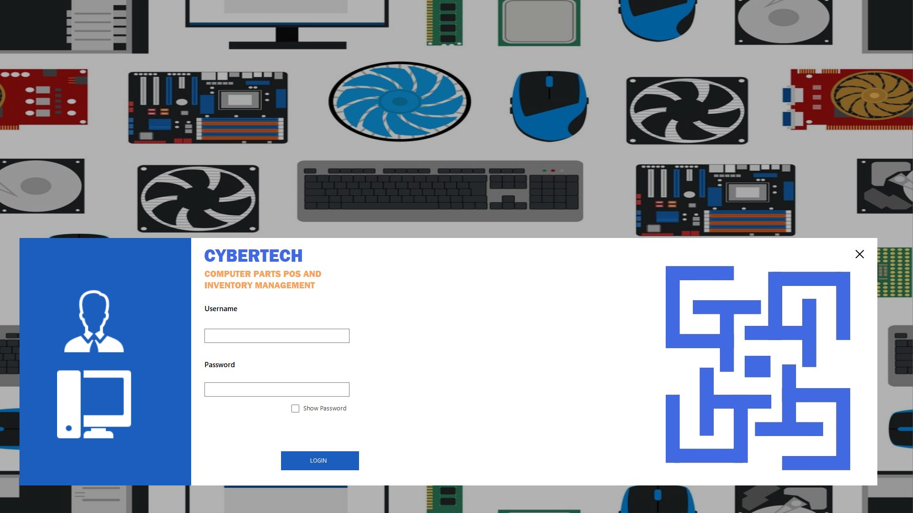
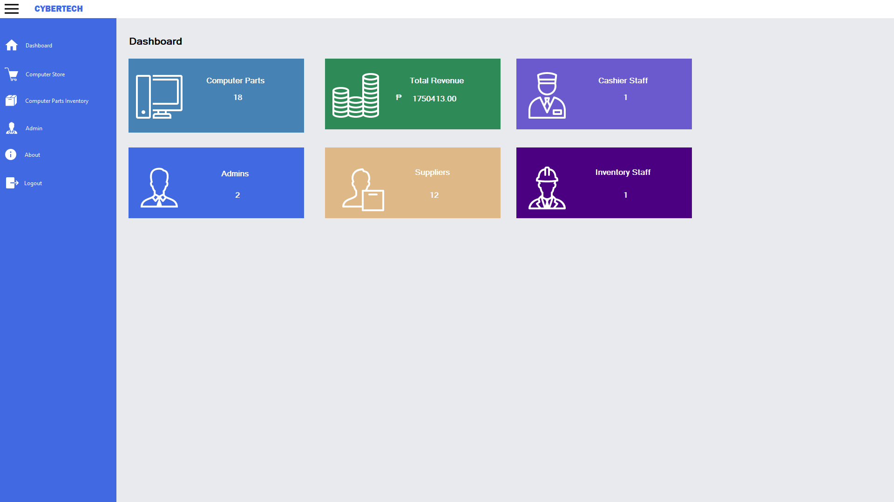
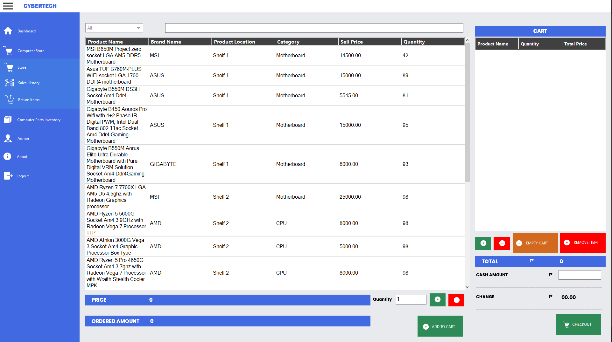
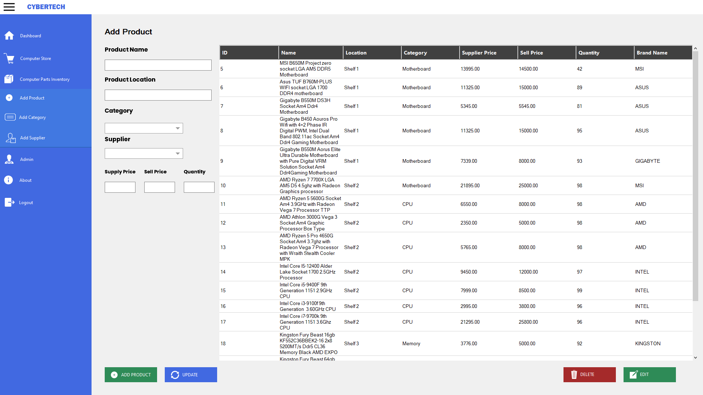

  

<h2 align="center">CyberTech POS & Inventory System</h2>

---

## Info
CyberTech is a computer parts retail system that combines point-of-sale (POS) functionality with inventory management, enabling efficient sales processing and stock monitoring.

---

## Features
- Point-of-Sale (POS) with cart and checkout  
- Inventory management system  
- Dashboard analytics  
- Sales tracking and history  
- Product, category, and supplier management  
- Secure login system  

---

## 🧠 Tech Stack
- **Language:** C#  
- **Framework:** .NET (Windows Forms / WPF)  
- **Database:** MySQL / SQL Server  
- **Tools:** Visual Studio  

---

## Screenshots

### Login

### Dashboard

### POS

### Inventory

---

## Installation
1. Clone the repository  
2. Open the project in Microsoft Visual Studio  
3. Restore NuGet packages  
4. Configure database connection  
5. Run the application  
